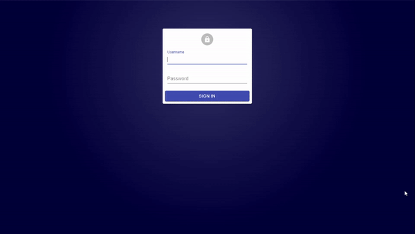

# Phone CRUD [](https://opensource.org/licenses/MIT)

The goal of this project is to have a simple web interface to view and edit records on a database. This project includes a frontend and a backend, referenced as external repositories. 

### Project structure

The web interface is a React App, you can find the source code and its documentation on the following link:
[phone-crud-frontend](https://github.com/balb0x/phone-crud-frontend)

For the backend the project uses python flask to publish an API rest interfacing with a MongoDB Database. The source code and documentation is found here:
[phone-crud-backend](https://github.com/balb0x/phone-crud-backend)

Those repositories can be deployed separately (Information on how to run them inside the projects) or can be deployed using the `docker-compose.yml` found in this repository, instructions below.

For a more detailed information of the components of the projects, follow the links. 

### Sample


### Download

To clone this repo, you need to clone also the submodules. Type this to clone:

```
git clone --recurse-submodules --remote-submodules https://github.com/balb0x/Phone-CRUD.git
```

### Deployment

The entire project is Docker friendly, so it can be deployed running the following line to build it:

``` 
docker-compose build 
```

And the next one to run it:

``` 
docker-compose up
``` 

The docker container runs 3 services, a mongo instance and the frontend/backend repositories:

- The backend exposes the API Rest on port `5000`

- The frontend exposes the web app on port `3000`

- The database is handled in the container

To load the web app once the container is running, enter this URL on your navigator:

```
http://127.0.0.1:3000
```

The default credentials for the admin panel are:

```
admin:password (phone and brand privileges)
operator:password (phone privileges)
```

### License

Phone CRUD is [MIT licensed](./LICENSE)